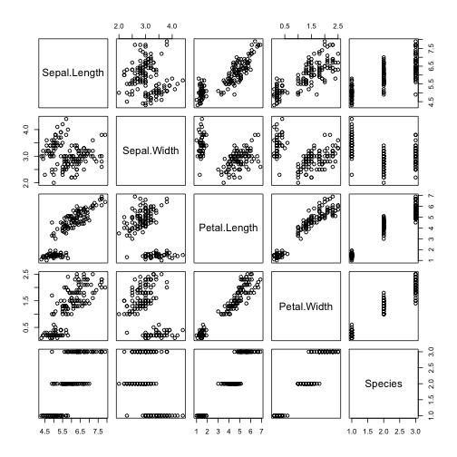
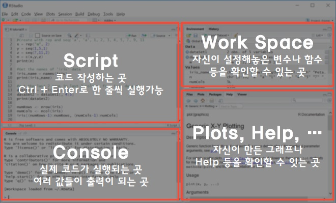

Tutorial, RStudio - MNIST For ML Beginners
========================================================
author: Sang Yeol Lee
date: June 27 2017
width: 1200 
height: 1700
transition: linear
transition-speed: slow
autosize: true

- 스터디 : 캐글뽀개기 - 텐서뽀개기
- 페이스북 : <https://www.facebook.com/groups/kagglebreak/>

- github : <https://github.com/KaggleBreak/tensorbreak>

- 구글드라이브 : 
<https://drive.google.com/drive/folders/0B2l0iH28o85xM3A3TVhGdkFHb3M>

- 교재 : 


1) hands on machine learning with scikit-learn and tensorflow

2) RStudio Tensorflow <https://tensorflow.rstudio.com/>


========================================================
id: slide1
type: prompt
## 텐서뽀개기 Part 1 (6/27 ~ 9/19)
## 취지 : 
  - 통계 또는 기계학습 기초 수준은 학습했지만 텐알못(텐서플로우를 알지 못하는 사람들, 저같은...ㅜㅜ) 학습
  - 텐서플로우 Python 코드를 R로 바꾸기
  - 취미 생활, 커뮤니티를 통한 친목 도모
  
## 필요 
  - 이론보다는 텐서플로우 코드 위주로 진행
  - R, Python 프로그래밍 기초는 다루지 않음
  - 격주 스터디므로 교재 위주로 발표 1 ~ 2시간, 나머지는 팀별 시간을 갖고 당일 진행한 코드 부분을 구글드라이브로 공유 하여 스스로의 학습을 유도
  
<br>
## 장소 및 지원 : R-korea, KossLab

### 장소 : 강남 토즈 (또는 토즈타워점)
### 시간 : 격주 화요일 (오후 7시30분 ~ 10시 30분)

<br>

### 참여 회비 : 추후 공지 (장소 및 행사 지원금 관련)

<br> 

### Reference : 
  - 1) https://tensorflow.rstudio.com/
  - 2) 모두를 위한 머신러닝/딥러닝 강의 (https://hunkim.github.io/ml/)
  - 3) 텐서플로우 한글 문서(https://tensorflowkorea.gitbooks.io/tensorflow-kr/content/g3doc/)

Show Time (R)
========================================================


```r
summary(cars)
```

```
     speed           dist       
 Min.   : 4.0   Min.   :  2.00  
 1st Qu.:12.0   1st Qu.: 26.00  
 Median :15.0   Median : 36.00  
 Mean   :15.4   Mean   : 42.98  
 3rd Qu.:19.0   3rd Qu.: 56.00  
 Max.   :25.0   Max.   :120.00  
```



========================================================

## 첫시간 : 설치 (Install)
[Go to slide 1](#/slide1)

- 먼저 컴퓨터 운영체제 확인
  - 내컴퓨터 -> 속성 -> 비트 버전(32/64bit) 확인
  - 32비트 버전 Tensorflow 설치 불가능. 윈도우 64비트 버전만
  
<br>

- R, RStudio, Anaconda(또는 Python3.5 -> pip), Tensorflow 설치 진행

  - 이미 R, Python 설치가 되어 있으면 다른 것을 해도 좋음
  - 윈도우에서 Tensorflow 설치하기 쉬운 방법 : [https://brunch.co.kr/@mapthecity/15]
  

<br> 

- Tensorflow CPU 버전으로 설치 
(GPU 버전은 개인 별로 설치 진행하는 것으로 하겠습니다)

<br>

- 설치 문제 발생 시 손들고 주변에서 도와주세요. (팀 별로)

========================================================

## 설치 (Install)

### R install
(https://cran.rstudio.com/bin/windows/base/)
* 3.4.0 최신 버전

> R 프로그래밍 언어(줄여서 R)는 통계 계산과 그래픽을 위한 프로그래밍 언어이자 소프트웨어 환경이다. 뉴질랜드 오클랜드 대학의 로버트 젠틀맨(Robert Gentleman)과 로스 이하카(Ross Ihaka)에 의해 시작되어 현재는 R 코어 팀이 개발하고 있다. R은 GPL 하에 배포되는 S 프로그래밍 언어의 구현으로 GNU S라고도 한다. R은 통계 소프트웨어 개발과 자료 분석에 널리 사용되고 있으며, 패키지 개발이 용이하여 통계학자들 사이에서 통계 소프트웨어 개발에 많이 쓰이고 있다.

- R 프로젝트 : <https://www.r-project.org/>

- CRAN 서버 : <https://cran.r-project.org/mirrors.html>

- R 블로거 : <https://www.r-bloggers.com/>

- CRAN Task View
<https://cran.r-project.org/web/views/>

- MRAN (Microsoft R Application Network)
<https://mran.microsoft.com/>

========================================================

### 왜 분석도구로 R인가?

- 기존의 통계툴인 SAS, SPSS에 비해서 자유롭게 변형 가능

- R은 데이터 분석에 특화된 프로그래밍 언어이자 오픈소스 패키지의 집합이다.
- 프로그래밍 언어 - 자유로운 데이터 분석이 가능
  * Graphical User Interface (GUI) 를 이용한 분석 환경은 처음에는 접근이 쉬우나 확장성에 한계가 있음
  * 스스로 새로운 기능을 추가하는 것도 자유로움

- 오픈소스 패키지의 집합 (통계, 기계학습, 금융, 생물정보학, 그래픽스)에 이르는 다양한 패키지가 무료로 제공됨.

* 최신 통계 분석 알고리즘의 우선 구현 
* 빅데이터 처리 : SparkR, Rhive, RHadoop 등
* 방대한 온라인 자료 : Stack Overflow [link](https://stackoverflow.com/questions/tagged/r)


========================================================

### O'Reilly 2016 Data Scientit Salary Survey

<br>

- [link](https://www.datanami.com/2016/10/10/whats-driving-data-science-salaries-now/)

- 미국의 데이터 과학자들의 평균 급여

- 오라일리 (O'Reilly)의 최근 2016 년 데이터 과학 연봉 조사 (Data Science Salary Survey )에 따르면 엑셀을 사용하는 회사를 위해 일하고 여성은 연봉이 낮은 것과 밀접한 상관 관계가 있다.

- 데이터 과학자 평균 급여 약 75,000 달러.
- IOR 범위 (55,000 ~ 110,000 달러)

***
<br>


========================================================

### R Example Project (Fun)
- Leaflet is one of the most popular open-source JavaScript libraries for interactive maps.

<https://rstudio.github.io/leaflet/>

- This is an introduction to wordcloud2 package. This package provides an HTML5 interface to wordcloud for data visualization. Timdream’s wordcloud2.js is used in this package.

<https://cran.r-project.org/web/packages/wordcloud2/vignettes/wordcloud.html>


- ggplot2 is a plotting system for R, based on the grammar of graphics, which tries to take the good parts of base and lattice graphics and none of the bad parts. It takes care of many of the fiddly details that make plotting a hassle (like drawing legends) as well as providing a powerful model of graphics that makes it easy to produce complex multi-layered graphics.

<http://www.r-graph-gallery.com/portfolio/ggplot2-package/>

- Network Analysis and Visualization with R and igraph

<http://kateto.net/networks-r-igraph>

========================================================
## 설치 (Install)
### RStudio install
Desktop
Open Source License
: <https://www.rstudio.com/products/rstudio/download/>

> RStudio is a free and open-source integrated development environment (IDE) for R, a programming language for statistical computing and graphics. RStudio was founded by JJ Allaire,[5] creator of the programming language ColdFusion. Hadley Wickham is the Chief Scientist at RStudio

- 다른 IDE Tools sublime <https://www.sublimetext.com/>



========================================================
## 설치 (Install)
### Anaconda install
Anaconda Download
: <https://www.continuum.io/downloads>

- Python 2.7 vs Python 3.6
  * [link](https://zetawiki.com/wiki/Python_%EB%B2%84%EC%A0%84_2%EC%99%80_3_%EC%B0%A8%EC%9D%B4)

- Python 3.6 버전 이상을 설치해주세요.
- Anaconda?
  *  아나콘다는 레드햇에서 만든 설치 소프트웨어 중 하나
  * 파이썬 기반의 데이터 분석에 특화된 각종 OpenSource 패키지들을 모아놓은 개발 플랫폼
  * 편리함. 기본 Python 버전으로 설치 시에 패키지 관리를 pip 시스템 이용 
  * 물론 아나콘다로 익숙해지다가 pip로 넘어가는 것이 유리
  * 윈도우 환경에서는 설정 관리하기 불편하니 아나콘다가 편리할 수도 있음

- 윈도우 환경에서 파이썬의 pip 설치 방법 : [link](http://be4rpooh02.tistory.com/8)

========================================================

### Python Example Project (Fun)
- Django is a high-level Python Web framework that encourages rapid development and clean, pragmatic design. 

<https://www.djangoproject.com/>

- 텐서플로우(TensorFlow™)는 데이터 플로우 그래프(Data flow graph)를 사용하여 수치 연산을 하는 오픈소스 소프트웨어 라이브러리입니다.  텐서플로우는 원래 머신러닝과 딥 뉴럴 네트워크 연구를 목적으로 구글의 인공지능 연구 조직인 구글 브레인 팀의 연구자와 엔지니어들에 의해 개발되었습니다. 

<https://tensorflowkorea.gitbooks.io/tensorflow-kr/content/g3doc/get_started/os_setup.html>

- Gensim Project, Topic modeling for Humans

<https://www.lucypark.kr/slides/2015-pyconkr/#1>

- Plotly (Plotly's Python graphing library makes interactive, publication-quality graphs online. Examples of how to make line plots, scatter plots, area charts, bar charts, error bars, box plots, histograms, heatmaps, subplots, multiple-axes, polar charts, and bubble charts)

<https://plot.ly/python/>

========================================================

## 설치 (Install)
### R Tensorflow library install

- tensorflow R 패키지를 사용하기 전에 시스템에 TensorFlow 버전을 설치해야합니다. 

Tensorflow install (windows)
: <https://brunch.co.kr/@mapthecity/15>

Tensorflow install (mac)
<https://meisteruser.net/devflow/1863>


Tensorflow library (RStudio install)
: <https://tensorflow.rstudio.com/>


- Hello World 예제


```r
library(devtools)
#install.packages('devtools')
#devtools::install_github("rstudio/tensorflow")

library(tensorflow)

sess = tf$Session()
hello <- tf$constant('Hello, TensorFlow!')
sess$run(hello)
```

```
[1] "Hello, TensorFlow!"
```

- 텐서플로우 한글 문서의 설치 방법에 대해서 자세히 적혀있음(https://tensorflowkorea.gitbooks.io/tensorflow-kr/content/g3doc/)

========================================================

## 두 번째 시간 : MNIST For ML Beginners 
[Go to slide 1](#/slide1)

- TensorFlow API는 TensorFlow 그래프를 만들고 실행할 수있는 일련의 파이썬 모듈로 구성됩니다. 

- tensorflow 패키지는 R 내에서 완전한 TensorFlow API에 대한 액세스를 제공합니다. 

- 다음은 몇 가지 데이터를 2 차원으로 작성한 다음 그 위에 한 줄을 맞추는 간단한 예제입니다.


```r
# Create 100 phony x, y data points, y = x * 0.1 + 0.3
x_data <- runif(100, min=0, max=1)
y_data <- x_data * 0.1 + 0.3

head(x_data)
```

```
[1] 0.574551222 0.652525949 0.474140186 0.009962419 0.746261198 0.553178174
```

```r
head(y_data)
```

```
[1] 0.3574551 0.3652526 0.3474140 0.3009962 0.3746261 0.3553178
```

========================================================

- 이 코드의 첫 번째 부분은 데이터 흐름 그래프를 작성합니다. 

- TensorFlow는 세션이 만들어지고 실행 함수가 호출 될 때까지 실제로 어떤 계산도 실행하지 않습니다.


```r
# Try to find values for W and b that compute y_data = W * x_data + b
# (We know that W should be 0.1 and b 0.3, but TensorFlow will
# figure that out for us.)
W <- tf$Variable(tf$random_uniform(shape(1L), -1.0, 1.0))
b <- tf$Variable(tf$zeros(shape(1L)))
y <- W * x_data + b

W
```

```
Variable(shape=(1,), dtype=float32_ref)
```

```r
b
```

```
Variable(shape=(1,), dtype=float32_ref)
```

```r
y
```

```
Tensor("Add:0", shape=(100,), dtype=float32)
```

========================================================


```r
# Minimize the mean squared errors.
loss <- tf$reduce_mean((y - y_data) ^ 2)
optimizer <- tf$train$GradientDescentOptimizer(learning_rate = 0.5)
train <- optimizer$minimize(loss)

loss
```

```
Tensor("Mean:0", shape=(), dtype=float32)
```

```r
train
```

```
name: "GradientDescent"
op: "NoOp"
input: "^GradientDescent/update_Variable/ApplyGradientDescent"
input: "^GradientDescent/update_Variable_1/ApplyGradientDescent"
```

```r
# Launch the graph and initialize the variables.
sess = tf$Session()
sess$run(tf$global_variables_initializer())

# Fit the line (Learns best fit is W: 0.1, b: 0.3)
for (step in 1:201) {
  sess$run(train)
  if (step %% 20 == 0)
    cat(step, "-", sess$run(W), sess$run(b), "\n")
}
```

```
20 - 0.2664804 0.2141265 
40 - 0.1492162 0.2746134 
60 - 0.1145497 0.292495 
80 - 0.1043013 0.2977813 
100 - 0.1012716 0.2993441 
120 - 0.1003759 0.2998061 
140 - 0.1001111 0.2999427 
160 - 0.1000329 0.2999831 
180 - 0.1000097 0.299995 
200 - 0.1000029 0.2999985 
```

========================================================

## MNIST For ML Beginners

- 이 자습서는 기계 학습과 TensorFlow를 처음 사용하는 독자를위한 것입니다. 당신이 이미 MNIST가 무엇인지, 그리고 softmax (다항 로지스틱 회귀) 회귀가 무엇인지 알고 있다면,이 빠른 페이스 튜토리얼을 선호 할 것입니다. 튜토리얼을 시작하기 전에 TensorFlow를 설치하십시오.

- 프로그래밍 방법을 배울 때 가장 먼저 할 일은 "Hello World"입니다. Hello World 프로그래밍이있는 것처럼 기계 학습에는 MNIST가 있습니다.

- MNIST는 간단한 컴퓨터 비전 데이터 세트입니다. 이것은 다음과 같은 자필 자릿수의 이미지로 구성됩니다.

- MNIST
<br>


- 각 이미지의 레이블을 포함하여 해당 이미지의 자리수를 알려줍니다. 예를 들어 위 이미지의 레이블은 5, 0, 4 및 1입니다.

- Softmax function
<br>


========================================================

- 이 자습서에서는 이미지를보고 어떤 자릿수인지 예측하는 모델을 훈련할 것입니다. 우리의 목표는 최첨단 성능을 구현하는 매우 정교한 모델을 훈련하는 것이 아닙니다. 

- 따라서 우리는 Softmax 회귀 (Softmax Regression)라고 불리는 매우 간단한 모델로 시작할 것입니다.

- 이 자습서의 실제 코드는 매우 짧으며 모든 흥미로운 내용은 단 3 줄에서 발생합니다. 그러나 TensorFlow가 작동하는 방법과 핵심 기계 학습 개념의 두 가지 아이디어를 이해하는 것이 매우 중요합니다. 이 때문에 우리는 코드를 통해 매우 신중하게 작업 할 것입니다.

<br>

### Using this Tutorial

- 이 튜토리얼은 mnist_softmax.R 코드에서 일어나는 일들에 대한 설명입니다.

- 이 자습서는 다음과 같은 몇 가지 방법으로 사용할 수 있습니다.

- 각 행에 대한 설명을 읽으면서 행별로 각 코드를 복사하여 R 환경에 붙여 넣으십시오.

- 설명을 읽기 전이나 후에 mnist_softmax.R R 파일 전체를 실행하고 이 튜토리얼을 사용하여 명확하지 않은 코드 행을 이해하십시오.

- 이 튜토리얼에서 우리가 달성 할 수있는 것 :

  - MNIST 데이터와 softmax 회귀에 대해 배웁니다.

  - 이미지의 모든 픽셀을보고 숫자를 인식하는 모델인 함수를 만듭니다.

  - TensorFlow를 사용하여 수천 가지 예제를 "보면서"숫자를 인식하도록 모델을 훈련하고 (이렇게 첫 번째 TensorFlow 세션을 실행하십시오)

- 테스트 데이터로 모델의 정확성을 확인하십시오.

========================================================

### The MNIST Data
- MNIST 데이터는 Yann Le
Cun의 웹 사이트에서 호스팅됩니다. 이 자습서의 코드를 복사하여 붙여 넣는 경우 다음 세 줄의 코드를 사용하여 데이터를 자동으로 다운로드하고 읽습니다.


```r
library(tensorflow)
datasets <- tf$contrib$learn$datasets
mnist <- datasets$mnist$read_data_sets("MNIST-data", one_hot = TRUE)
```

- MNIST 데이터는 세 가지 부분으로 나뉩니다 : 55,000 데이터 포인트의 교육 데이터 (train), 10,000 포인트의 테스트 데이터 (test) 및 5,000 포인트의 유효성 검사 데이터 (밸리데이션). 이 분할은 매우 중요합니다.

- 앞서 언급했듯이, 모든 MNIST 데이터 포인트는 두 부분으로되어 있습니다 : 손으로 쓴 숫자의 이미지와 해당 레이블. 우리는 이미지 "x"와 레이블 "y"를 부를 것입니다. 트레이닝 세트와 테스트 세트는 모두 이미지와 해당 레이블을 포함합니다. 예를 들어 트레이닝 이미지는 images이고 트레이닝 라벨은 labels입니다.

- 각 이미지는 28 x 28 픽셀입니다. 이것을 숫자의 큰 배열로 해석 할 수 있습니다.


========================================================

### The MNIST Data
- 이 배열을 28x28 = 784 숫자의 벡터로 전개 할 수 있습니다. 우리가 이미지간에 일관성이 있는 한 배열을 어떻게 평평하게 만드는지는 중요하지 않습니다. 이 관점에서 볼 때, MNIST 이미지는 매우 풍부한 구조 (경고 : 계산 집약적 시각화)와 함께 784 차원의 벡터 공간에서 단지 한 묶음의 지점에 불과합니다.

- images는 쉐이프 (55000L, 784L)를 갖는 텐서 (n 차원 배열)입니다. 첫 번째 차원은 이미지 목록에 대한 인덱스이고 두 번째 차원은 각 이미지의 각 픽셀에 대한 인덱스입니다. 텐서의 각 엔트리는 특정 이미지의 특정 픽셀에 대해 0과 1 사이의 픽셀 강도입니다.


========================================================

### The MNIST Data
- MNIST의 각 이미지에는 이미지에 그려지는 숫자를 나타내는 0에서 9 사이의 숫자가 해당 레이블을 가지고 있습니다.

- 튜토리얼의 목적을 위해 우리는 레이블을 "원 핫 벡터 (one-hot vectors)"로 원할 것입니다. 


- ont-hot 벡터는 대부분 차원에서 0이고 단일 차원에서 1 인 벡터입니다. 

- 이 경우 nth 숫자는 nth 차원에서 1 인 벡터로 표시됩니다. 예를 들어, 3은 [0,0,0,1,0,0,0,0,0,0] 입니다. 

- mnist$train$labels은 (55000L, 10L) 수레 배열입니다.


========================================================

### Softmax Regressions

- 우리는 MNIST의 모든 이미지가 0에서 9 사이의 자필 자릿수임을 알고 있습니다. 따라서 주어진 이미지가 될 수있는 것은 10 가지 밖에 없습니다. 우리는 이미지를보고 각 숫자가 될 확률을 줄 수 있기를 원합니다. 

- 예를 들어, 우리 모델은 9의 그림을보고 80 %의 확률로 9라는 것을 확신 할 수 있지만, 상위 루프 때문에 8 %가 될 확률이 5 %이므로 다른 모든 패턴에 대해 약간의 확률이 발생할 수 있습니다. 100 % 확실하지 않습니다.

- 이것은 softmax 회귀가 자연스럽고 단순한 모델 인 고전적인 사례입니다. 여러 다른 것들 중 하나 인 객체에 확률을 할당하려면 softmax가 0과 1 사이의 값 목록을 제공하기 때문에 softmax가해야 할 일입니다. 나중에도 더 정교한 모델, 마지막 단계는 softmax의 레이어가 될 것입니다.

- Softmax 회귀 분석은 두 단계로 이루어져 있습니다. 먼저 특정 클래스에 입력의 증거를 추가 한 다음 해당 증거를 확률로 변환합니다.

- 주어진 이미지가 특정 클래스에 있다는 증거를 계산하기 위해 픽셀 강도의 가중치 합을 계산합니다. 높은 강도를 갖는 픽셀이 해당 클래스에있는 이미지에 대한 증거라면 가중치는 음수이고, 유리한 증거라면 긍정적입니다.

- 다음 다이어그램은 이러한 각 클래스에 대해 학습 한 모델의 가중치를 보여줍니다. 빨간색은 음수를 나타내고 파란색은 양수를 나타냅니다.


========================================================

- 우리는 bias이라고 불리는 몇 가지 추가 증거를 추가합니다. 기본적으로, 우리는 어떤 것들이 입력으로부터 더 독립적이라고 말할 수 있기를 원합니다. 결과는 클래스 x에 대한 입력 xx에 대한 증거는 다음과 같다.

- 다음 "softmax"함수를 사용하여 예측 확률 y로 변환합니다.

- 입력 값을 지수화 한 다음 정규화합니다. Softmax는 이러한 가중치를 정규화하여 최대 1을 합산하여 유효한 확률 분포를 형성합니다. 

- Softmax 회귀 분석을 다음과 같이 보일 수 있습니다. 각 출력에 대해  가중 합계를 계산하고 바이어스를 추가 한 다음 softmax를 적용합니다.


- 우리는 이 과정을 "벡터화 (vectorize)"하여 행렬 곱셈과 벡터 덧셈으로 바꿀 수 있습니다. 이것은 계산 효율에 도움이됩니다. (생각할 수있는 유용한 방법이기도합니다.)

- y=softmax(Wx+b)


========================================================

### Implementing the Regression

- R에서 효과적인 수치 계산을 수행하기 위해 일반적으로 다른 언어로 구현 된 매우 효율적인 코드를 사용하여 R 외부의 행렬 곱셈과 같은 값 비싼 연산을 수행하는 기본 R 함수를 호출합니다. 불행하게도 모든 작업에 대해 R로 다시 전환하면 많은 오버 헤드가 발생할 수 있습니다. 이 오버 헤드는 GPU에서 계산을 실행하거나 데이터를 전송하는 데 비용이 많이 드는 분산 된 방식으로 실행하려는 경우 특히 나쁩니다.

- TensorFlow는 R 외부에서 무거운 짐을 싣지 만이 오버 헤드를 피하기 위해 더 나아갑니다. R과 독립적으로 고가의 단일 연산을 실행하는 대신 TensorFlow를 사용하여 R 외부에서 완전히 실행되는 상호 작용 연산의 그래프를 설명 할 수 있습니다 

- 우리는 기호 변수를 조작하여 이러한 상호 작용을 설명합니다. TensorFlow API에 액세스하려면 tensorflow 패키지에서 내 보낸 tf 객체를 참조하십시오.


```r
library(tensorflow)
x <- tf$placeholder(tf$float32, shape(NULL, 784L))

x
```

```
Tensor("Placeholder:0", shape=(?, 784), dtype=float32)
```

- x는 특정 값이 아닙니다. 자리 표시 자입니다. TensorFlow에 계산을 실행하도록 요청할 때 입력 할 값입니다. 

- 우리는 무수히 많은 MNIST 이미지를 입력 할 수 있기를 원합니다. 각각의 이미지는 784 차원의 벡터로 전개됩니다. 

- 이것을 2 차원 텐서 형태의 부동 소수점 숫자 (shape, NULL, 784L)로 표현합니다. 여기서 NULL은 차원의 길이가 임의 일 수 있음을 의미합니다.


========================================================

### Implementing the Regression


```r
W <- tf$Variable(tf$zeros(shape(784L, 10L)))
b <- tf$Variable(tf$zeros(shape(10L)))
```


- 우리 모델의 가중치와 bias도 필요합니다. 이러한 요소를 추가 입력처럼 처리한다고 상상할 수도 있지만 TensorFlow는 변수를 처리하는 더 좋은 방법을 제공합니다.

- 변수는 상호 작용하는 작업의 TensorFlow 그래프에있는 수정 가능한 텐서입니다. 그것은 계산에 의해 사용되거나 심지어 수정 될 수 있습니다. 

- tf$Variable에 변수의 초기 값을 지정하여 이러한 변수를 만듭니다.이 경우 W와 b를 모두 0으로 채워진 텐서로 초기화합니다. 우리는 W와 B를 배우려고하기 때문에 처음에는 무엇이 중요하지 않습니다.

- W가 784 차원의 이미지 벡터를 곱하여 차이 클래스에 대한 증거의 10 차원 벡터를 생성하고자하므로 모양 (784, 10)이 있음에 유의하십시오. b는 shape (10)을 가지므로 출력에 추가 할 수 있습니다.


```r
y <- tf$nn$softmax(tf$matmul(x, W) + b)

y
```

```
Tensor("Softmax:0", shape=(?, 10), dtype=float32)
```

- 먼저, x에 W를 곱하여 matmul (x, W)라는 표현식을 만든다. 다중 입력을 갖는 2D 텐서 인 것을 처리하기 위한 작은 트릭으로서 WxWx가있는 방정식에서 곱해진 시점에서 뒤집 힙니다. 그런 다음 b를 추가하고 마지막으로 softmax를 적용합니다.


========================================================

### Training the Model

- 우리 모델을 훈련시키기 위해서는 비용 또는 손실을 통해서 계산, 모델이 원하는 결과와 얼마나 멀리 떨어져 있는지 나타냅니다. 우리는 오류를 최소화하려고 노력하며 오류 마진이 작을수록 모델이 좋습니다. 크로스 엔트로피 (cross-entropy)는 정보 이론에서 정보를 압축하는 정보를 생각할 때 발생하지만, 도박에서부터 많은 분야에서 중요한 아이디어가 되고 있습니다 


- −∑i yi * log(y′i), yi 는 라벨 값으로 one-hot vector로 주어지고, y′i는 훈련 계산결과

| 계산결과 | 라벨(A/B/C) | correct? |
| :--- | :---: | ---: |
| 0.3  0.3  0.4  | 0  0  1 (A) | yes |
| 0.3  0.4  0.3 | 0  1  0 (B) | yes |
| 0.1  0.2  0.7 | 1  0  0 (C) | no |


| 계산결과 | 라벨(A/B/C) | correct? |
| :--- | :---: | ---: |
| 0.1  0.2  0.7  | 0  0  1 (A) | yes |
| 0.1  0.7  0.2 | 0  1  0 (B) | yes |
| 0.3  0.4  0.3 | 1  0  0 (C) | no |


- -(ln(0.4) + ln(0.4) + ln(0.1)) / 3 = 1.38

- -(ln(0.7) + ln(0.7) + ln(0.3)) / 3 = 0.64


========================================================

### Training the Model

- 여기서 y는 예측 된 확률 분포이고, y'는 실제 분포입니다 (숫자 레이블이있는 원 핫 벡터). 


```r
y_ <- tf$placeholder(tf$float32, shape(NULL, 10L))

cross_entropy <- tf$reduce_mean(-tf$reduce_sum(y_ * tf$log(y), reduction_indices=1L))

optimizer <- tf$train$GradientDescentOptimizer(0.5)
train_step <- optimizer$minimize(cross_entropy)
```

- 이 경우 학습 속도가 0.5 인 그래디언트 디센트 알고리즘을 사용하여 교차 엔트로피를 최소화하도록 TensorFlow에 요청합니다. 그라디언트 디센트는 간단한 절차입니다. TensorFlow는 각 변수를 비용을 줄이는 방향으로 조금씩 이동합니다. 
- 여기서 백그라운드에서 TensorFlow가 실제로 수행하는 작업은 그라디언트 디센트를 구현하는 새 작업을 그래프에 추가하는 것입니다. 
- 이제 우리 모델을 훈련시킬 수있게되었습니다. 우리가 실행하기 전에 마지막으로, 우리가 만든 변수를 초기화하는 연산을 만들어야합니다. 


```r
init <- tf$global_variables_initializer()
```


========================================================

### Training the Model


```r
sess <- tf$Session()
sess$run(init)

for (i in 1:1000) {
  batches <- mnist$train$next_batch(100L)
  batch_xs <- batches[[1]]
  batch_ys <- batches[[2]]
  sess$run(train_step,
           feed_dict = dict(x = batch_xs, y_ = batch_ys))
}
```

- 루프의 각 단계마다 우리의 훈련 세트에서 100 개의 무작위 데이터 포인트의 "배치"를 얻습니다. 일괄 처리 데이터에서 train_step feeding을 실행하여 자리 표시자를 대체합니다.


========================================================

### Evaluating Our Model

- 우선 우리가 올바른 라벨을 어디에서 예측했는지 알아 보겠습니다. argmax는 어떤 축을 따라 텐서에서 가장 높은 엔트리의 인덱스를 제공하는 매우 유용한 함수입니다. 

- 예를 들어,  argmax (y, 1L)는 우리 모델이 각 입력에 대해 가장 가능성이 있다고 생각하는 레이블이고, argmax (y, 1L)는 올바른 레이블입니다. 


```r
correct_prediction <- tf$equal(tf$argmax(y, 1L), tf$argmax(y_, 1L))
```

- TensorFlow API의 텐서는 0 기반이기 때문에 tf $ argmax가 텐서의 두 번째 차원에서 작동해야한다고 지정하기 위해 1L을 전달합니다.

- correct_prediction은 boolean의 벡터입니다. 어떤 부분이 올바른지 판단하기 위해 부동 소수점 수로 캐스팅 한 다음 평균을 취합니다. 예를 들어, (TRUE, FALSE, TRUE, TRUE)는 (1.0, 0.0, 1.0, 1.0)이되어 0.75가됩니다.


```r
accuracy <- tf$reduce_mean(tf$cast(correct_prediction, tf$float32))

sess$run(accuracy, feed_dict=dict(x = mnist$test$images, y_ = mnist$test$labels))
```

```
[1] 0.9194
```


